# LKG-GEN 项目文档

本文档全面介绍了 LKG-GEN (Large Knowledge Graph Generator) 知识图谱生成平台，包括项目简介、技术架构、安装部署、核心功能操作手册。

---

## 1. 项目简介 (Project Overview)

LKG-GEN 是一个基于大知识库的智能知识图谱生成与管理平台。它能够将非结构化的文本数据（如论文、报告等）转化为结构化的知识图谱，并提供可视化的图谱展示、实体关系管理以及基于图谱的智能问答功能。

**核心价值：**
- **自动化图谱构建**：利用大语言模型（LLM）自动从文本中提取实体和关系。
- **可视化交互**：直观展示知识节点及其关联，支持交互式探索。
- **智能问答**：结合 RAG（检索增强生成）与知识图谱，提供精准的问答服务。
- **全流程管理**：支持从文档上传、图谱构建到实体修正的全流程管理。

---

## 2. 技术架构 (Technical Architecture)

本项目采用前后端分离架构，确保系统的高扩展性与维护性。

### 2.1 技术栈

| 模块 | 技术选型 | 说明 |
| :--- | :--- | :--- |
| **前端 (Frontend)** | React 18 | 用户界面构建 |
| | TypeScript | 静态类型检查 |
| | Ant Design | UI 组件库 |
| | Vis.js (vis-network) | 知识图谱可视化渲染 |
| | Axios | HTTP 请求处理 |
| **后端 (Backend)** | Python 3.13+ | 核心开发语言 |
| | FastAPI | 高性能 Web 框架 |
| | Pydantic | 数据验证与设置管理 |
| | LangChain / LLM | 大模型集成与 Prompt 管理 |
| **数据库 (Database)** | Neo4j | 图数据库，存储实体与关系 |
| | SQLite | 关系型数据库，存储文档原文与系统配置 |

### 2.2 核心流程逻辑

1. **文档处理**：用户上传文档 -> 后端存储至 SQLite -> 触发知识抽取任务。
2. **知识抽取**：文档分块 -> LLM 提取实体与关系 -> 数据清洗 -> 存入 Neo4j。
3. **图谱应用**：前端通过 API 获取图数据 -> Vis.js 渲染 / 聊天界面调用 RAG 接口。

---

## 3. 环境准备 (Environment Setup)

在部署项目前，请确保本地环境满足以下要求：

- **操作系统**：Linux (推荐), MacOS, Windows
- **Python**：版本 >= 3.13
- **Node.js**：版本 >= 16.0 (推荐使用 LTS 版本)
- **Neo4j**：版本 >= 5.15 (需开启 Bolt 端口，默认 7687)

---

## 4. 安装与启动 (Installation & Setup)

### 4.1 启动后端服务

本项目推荐使用 `uv` 进行环境管理，虚拟环境位于项目根目录下。

1.  **安装 uv** (如果尚未安装)：
    ```bash
    pip install uv
    # 或者参考 uv 官方文档
    ```

2.  **初始化环境与安装依赖**：
    在项目根目录 (`LKG-GEN/`) 下执行：
    ```bash
    uv sync
    ```
    *这将根据 `pyproject.toml` 和 `uv.lock` 自动创建 `.venv` 虚拟环境并安装所有依赖。*

3.  **激活虚拟环境**：
    ```bash
    source .venv/bin/activate
    # Windows: .venv\Scripts\activate
    ```

4.  **启动后端服务**：
    ```bash
    cd backend
    python main.py
    ```
    *后端服务默认运行在 `http://localhost:8000`*

### 4.2 启动前端服务

1.  进入前端目录：
    ```bash
    cd frontend
    ```

2.  安装依赖：
    ```bash
    npm install
    # 或者
    pnpm install
    ```

3.  启动开发服务器：
    ```bash
    npm start
    ```
    *前端页面默认运行在 `http://localhost:3000`*

---

## 5. 操作手册 (Operation Manual)

本章节详细说明系统的各个功能模块及操作步骤。

### 5.1 系统仪表盘 (Dashboard)
登录系统后，首先进入仪表盘页面。此处展示了系统的整体统计数据，包括知识图谱总数、文档总数等核心指标。

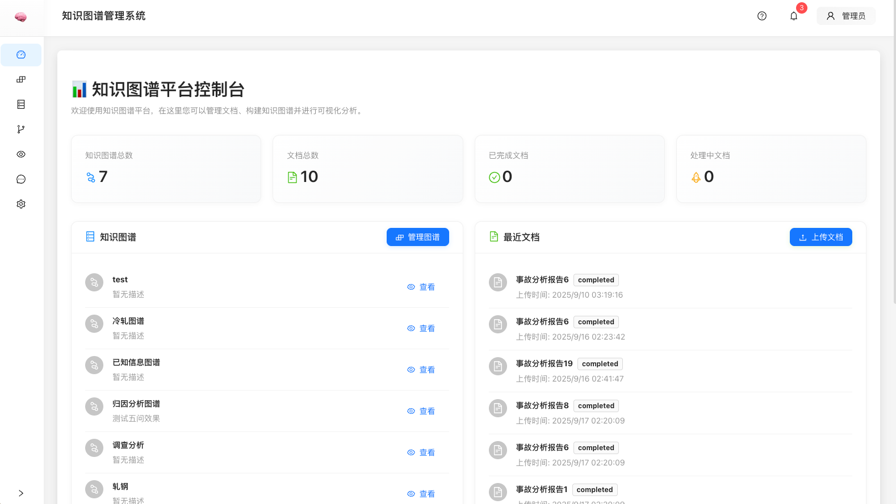
*(请将您的截图命名为 `dashboard.png` 并保存在项目根目录的 `screenshots` 文件夹中)*

### 5.2 知识图谱构建 (Knowledge Graph Builder)
在此模块中，您可以创建和配置新的知识图谱项目。

**功能说明：**
- **步骤引导**：系统采用分步向导模式，包括文档清洗、分块、实体提取、消歧、关系提取等阶段。
- **状态监控**：实时显示各阶段的处理状态（如：文档清洗中、实体提取中）。
- **文件上传**：支持拖拽上传 Markdown 文件。
- **图谱选择**：可选择将新文档添加到现有图谱或创建新图谱。

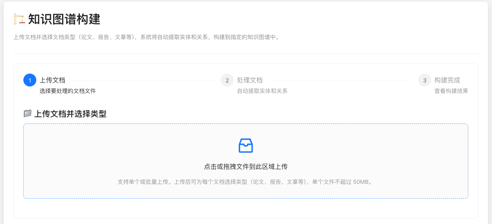


### 5.3 知识图谱管理 (Knowledge Graph Management)
本模块包含图谱的详细管理功能，分为以下子模块：

#### 5.3.1 图谱概览 (Graph Overview)
查看当前系统中所有图谱的列表。

**功能说明：**
- **列表展示**：显示图谱名称、描述、创建时间等信息。
- **快捷操作**：支持查看详情、编辑基本信息或删除图谱。

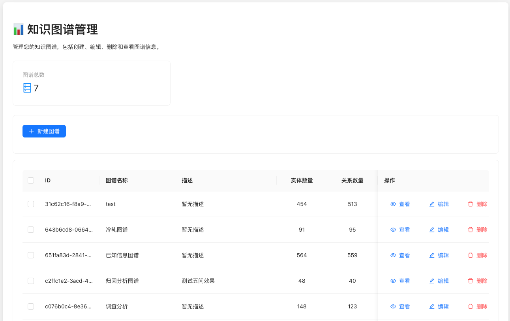

#### 5.3.2 文档管理 (Document Manager)
在此模块中，您可以查看和管理SQLite数据库中的源文档及其处理状态。

**功能说明：**
- **状态概览**：顶部卡片展示文档总数、待处理、处理中及已完成的文档数量。
- **列表管理**：查看文档ID、文件名、资源类型、当前状态及上传时间。
- **文档操作**：
    - **查看**：预览文档内容。
    - **删除**：移除文档及相关记录。
    - **刷新列表**：获取最新的文档处理进度。

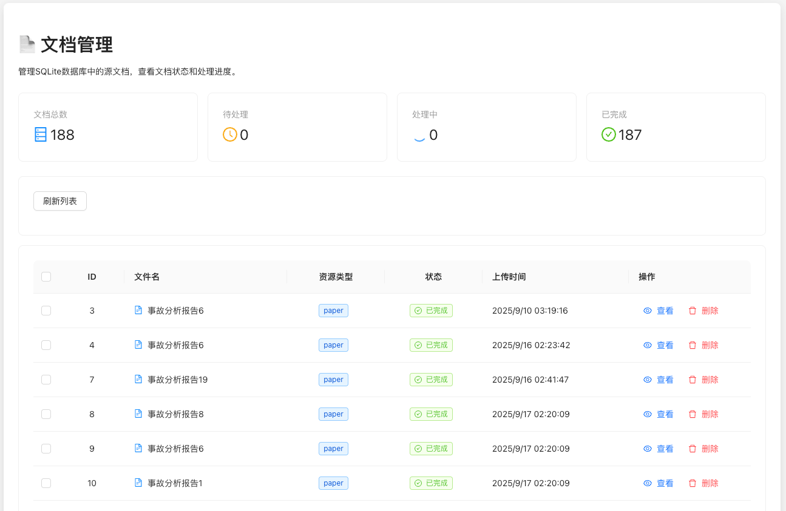

#### 5.3.3 实体管理 (Entity Manager)
图谱构建完成后，您可以在此查看和修正提取出的实体。

**功能说明：**
- **筛选查询**：支持按所属图谱、源文档进行筛选，或搜索实体名称。
- **列表展示**：查看实体名称、类型、描述等详细信息。
- **子图预览**：支持查看选中实体的关联子图。
- **管理操作**：编辑实体属性或删除错误实体。

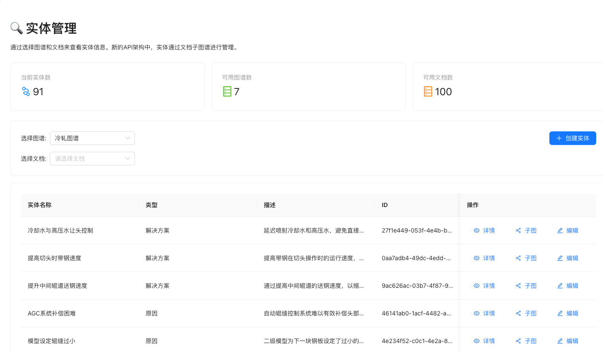


#### 5.3.4 关系管理 (Relation Manager)
在此管理实体之间的关联关系。

**功能说明：**
- **筛选查询**：支持按所属图谱、源文档进行筛选。
- **三元组列表**：直观展示“源实体 -> 关系 -> 目标实体”结构。
- **关系维护**：支持手动创建新关系，编辑现有关系类型，或断开错误连接。

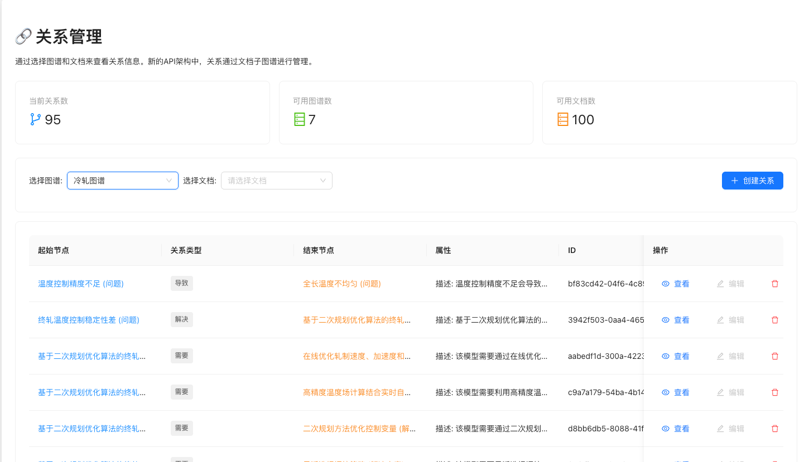


#### 5.3.5 分类管理 (Category Manager)
用于管理知识图谱的分类体系结构。

**功能说明：**
- **树状视图**：以树形结构展示分类层级。
- **分类维护**：选择图谱后，可添加新的分类节点，构建层次化的知识体系。
- **子图关联**：查看特定分类下的知识子图。

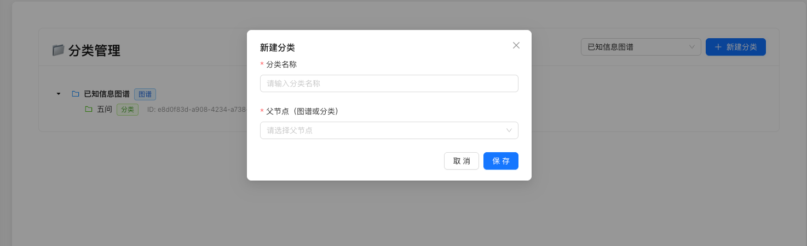


### 5.4 实体歧义消除 (Entity Disambiguation)
处理同名异义或异名同义的实体问题。

**功能说明：**
- **自动检测**：基于 Embedding 相似度自动检测潜在的重复实体对。
- **建议列表**：展示检测到的相似实体对及其相似度分数。
- **合并操作**：提供界面让用户确认并合并实体，统一知识表达。

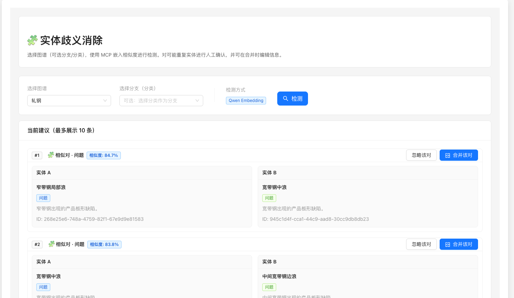


### 5.5 图谱可视化 (Graph Visualization)
这是系统的核心展示界面。

**功能亮点：**
- **交互式画布**：支持拖拽节点、缩放视图，探索图谱结构。
- **工具栏**：提供全屏、下载截图、搜索定位、布局刷新等实用工具。
- **详情侧栏**：点击节点或连线，侧边栏显示详细属性及原始文本来源。
- **设置面板**：自定义节点大小、颜色及布局算法。

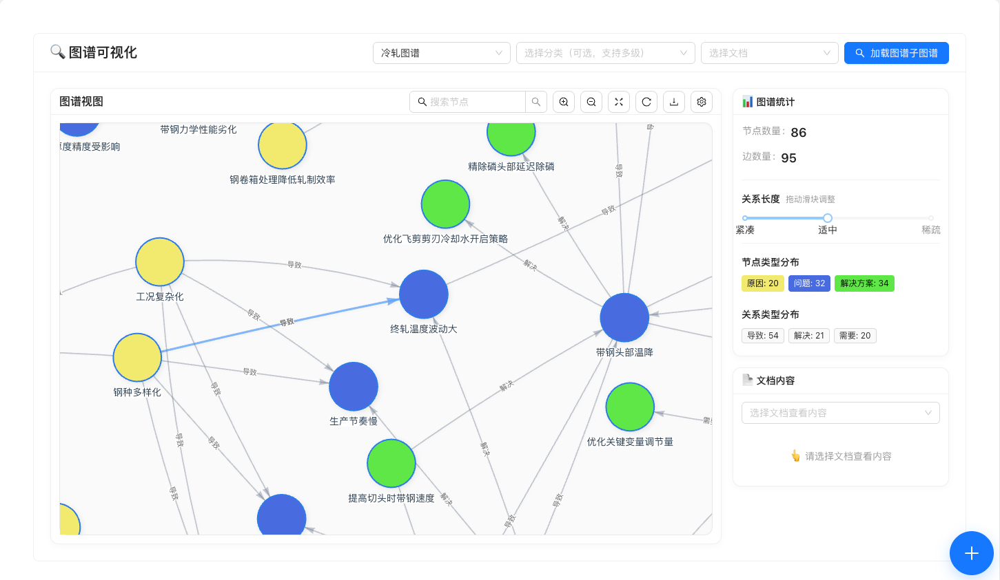


### 5.6 图谱问答 (Graph QA)
基于构建好的知识图谱进行自然语言问答。

**操作步骤：**
1. **选择图谱**：在下拉框中选择要进行问答的知识图谱。
2. **提问互动**：在对话框输入问题，系统将结合图谱数据生成答案。
3. **结果展示**：答案中包含引用的知识路径，并提供相关的图谱可视化切片。

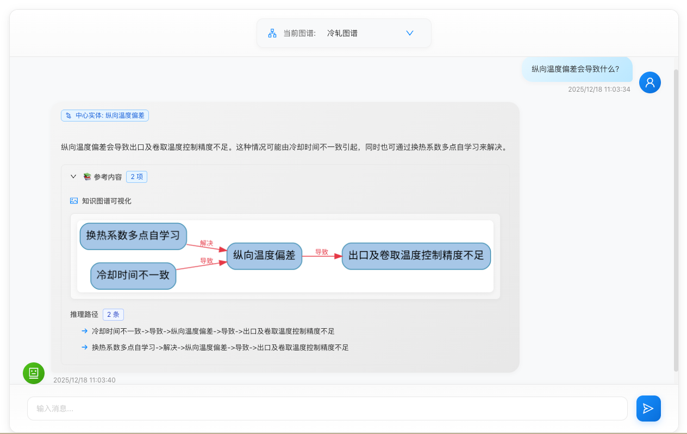


### 5.7 系统设置 (Settings)
在此配置系统的核心参数。

**功能模块：**
- **常规设置**：配置系统名称、语言、主题及自动保存策略。
- **处理配置**：调整文件处理的批次大小、并发数等性能参数。
- **AI 配置**：设置 LLM 模型、API Key、Temperature 等参数。
- **可视化配置**：自定义图谱的默认展示样式。

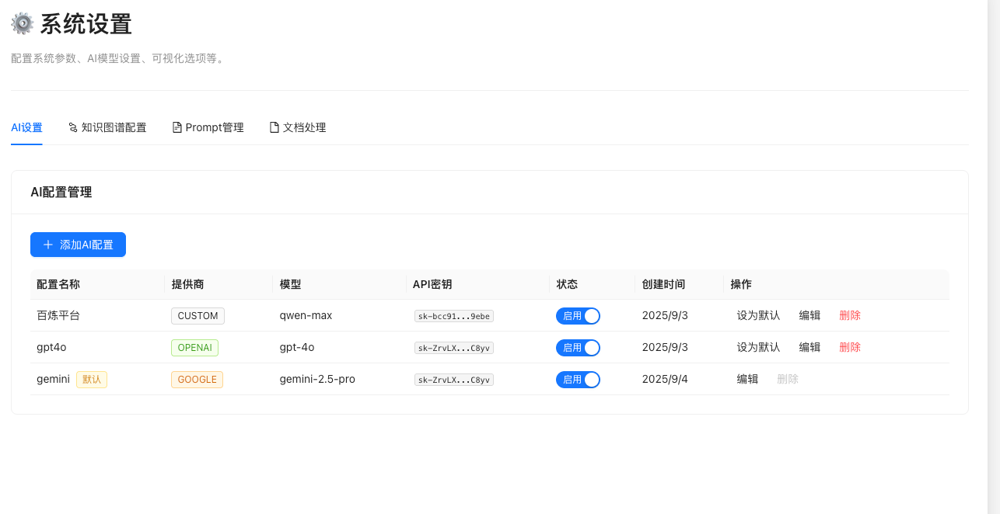

---

## 6. 目录结构说明 (Directory Structure)

### 后端结构 (`backend/`)
- `app/api/`：API 路由定义。
- `app/core/`：核心业务逻辑（抽取器、清洗器等）。
- `app/db/`：数据库连接会话（Neo4j, SQLite）。
- `app/models/` & `app/schemas/`：数据模型定义。
- `app/services/`：业务服务层（文档处理、图谱服务）。
- `app/worker/`：**后台任务队列（文档提取图谱核心部分）**。

### 前端结构 (`frontend/src/`)
- `components/`：通用 UI 组件。
- `pages/`：各功能页面组件（Dashboard, Chat, Graph 等）。
- `services/`：API 接口封装。

---

## 7. 常见问题 (FAQ)

**Q: 为什么上传文档后图谱没有立即更新？**
A: 知识抽取是一个耗时过程，依文档大小而定。请在文档列表中查看处理状态，待状态变为"已完成"后刷新图谱页面。

**Q: 如何清空所有数据？**
A: 可以使用提供的脚本 `backend/scripts/clear_neo4j.py` 清空图数据库，或直接删除 `backend/app.db` (SQLite) 文件来重置系统。

**Q: 支持哪些文档格式？**
A: 目前主要支持 Markdown (.md) 格式的文档。对于其他格式（如 PDF, TXT），建议先转换为 Markdown 格式后再上传。


**Q: 如何设计prompt模板？**


